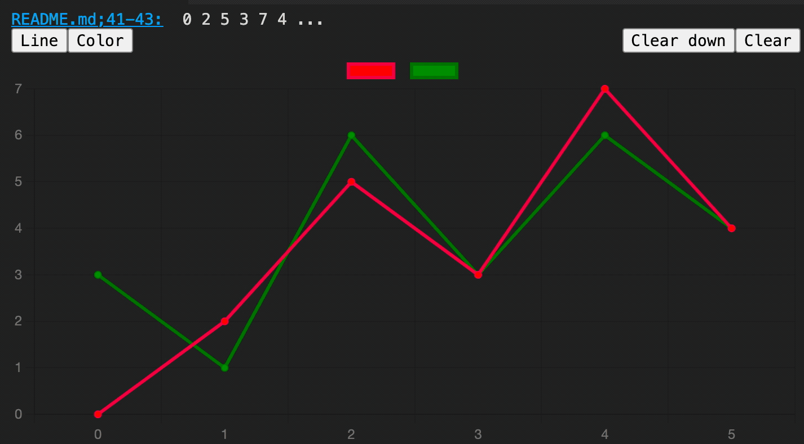
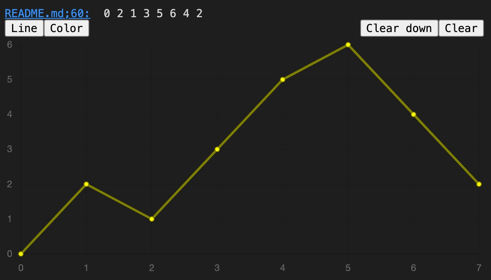
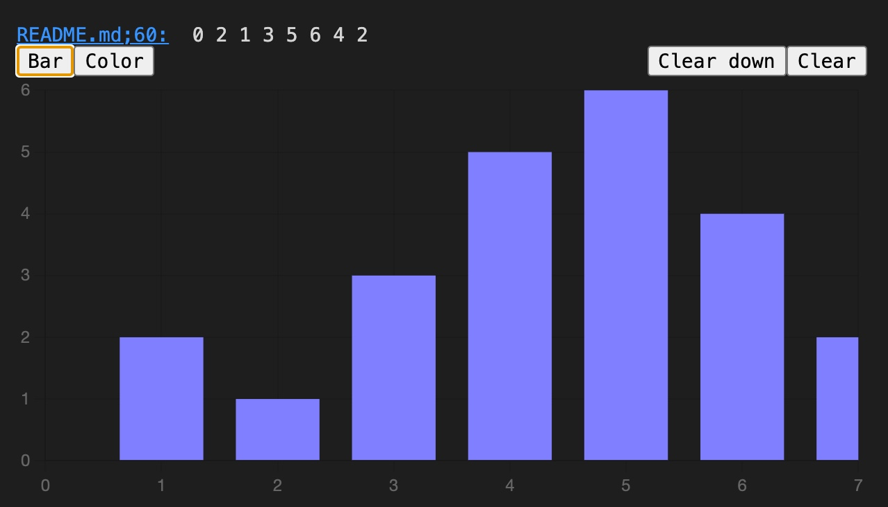
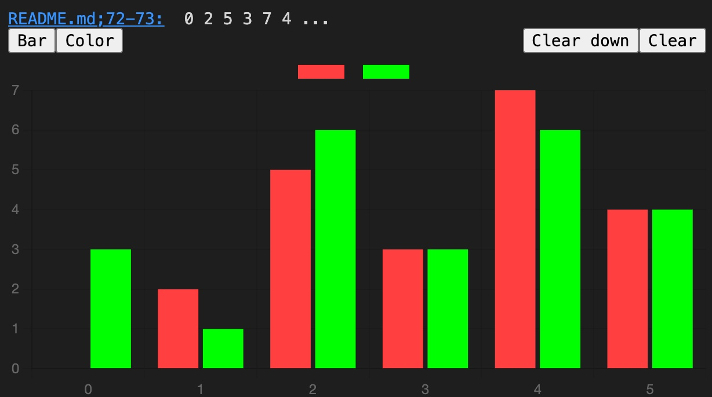
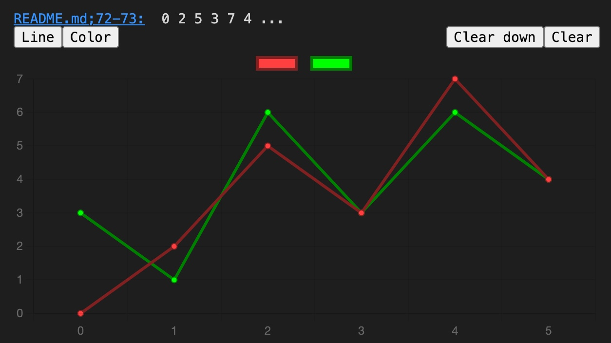
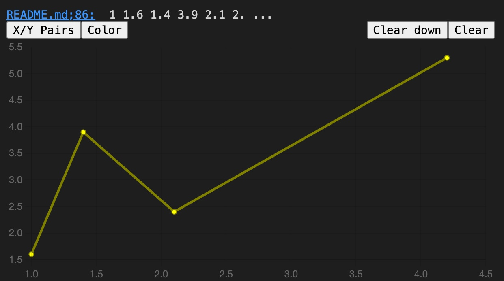
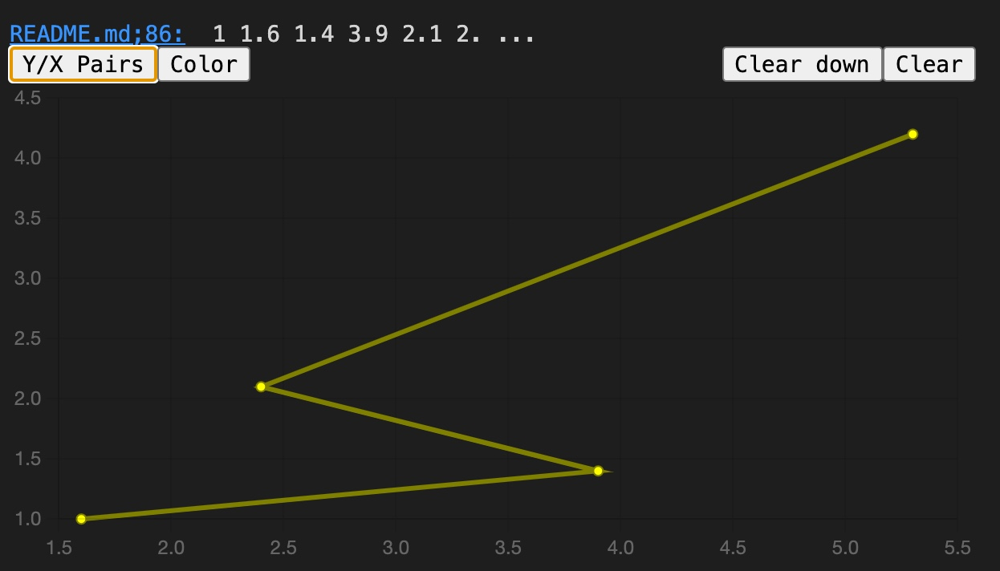
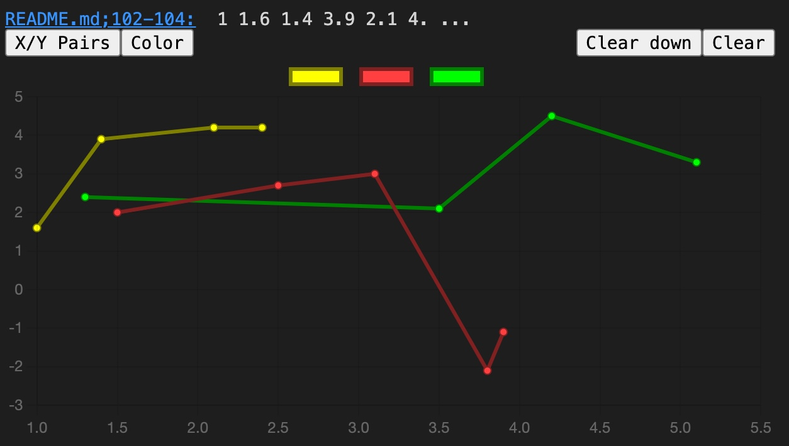
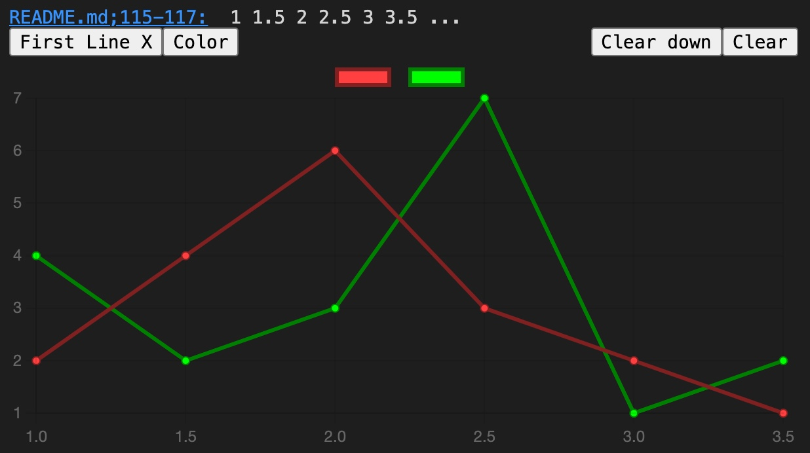

# Support

If you like "Number Plotter" please consider supporting it.

&nbsp;&nbsp;

# Number Plotter

The "Number Plotter" is a vscode extension that takes a series of selected numbers and creates a plot out of it.

# Example / Howto

Select the number series below, right-click and select "Plot->Line/Bar Chart":

~~~
0 2 1 3 5 6 4 2
~~~

You should see the following:

This is a line plot of the selected numbers.

You can change the color with the "Color" button and you can toggle between line and bar plot with the first button.

Now select this number series. Select both lines. Again right-click and select "Plot->Line/Bar Chart":

~~~
  0 2 5   3 7  4
3 1 6 3 6   4
~~~

You will see 2 plots, i.e. each select line becomes one data series:

Again you can change the type:

Apart from line/bar charts you can also display x/y graphs (i.e. scatter charts).

Please select the numbers below, right-click and select "Plot->X/Y Chart":

~~~
1 1.6 1.4 3.9 2.1 2.4 4.2 5.3
~~~

When parsing the data the numbers are expected as x/y pairs.
When shown you can change the order to y/x pairs with the button:

Again you can also select several lines:

~~~
1 1.6 1.4 3.9 2.1 4.2 2.4 4.2 5.3
1.5 2 2.5 2.7 3.1 3 3.8 -2.1 3.9 -1.1
1.3 2.4 3.5 2.1 4.2 4.5 5.1 3.3
~~~

If you select several lines you have two more options for parsing the data:
a) The first line contains only x values and the other lines contain y values for different data series
b) vice versa. I.e. the first line contains the y values and the other lines the different x values.

E.g. select the following lines, create the X/Y chart and select "First Line X" from the button:

~~~
1 1.5 2 2.5 3 3.5
2 4 6 3 2 1
4 2 3 7 1 2
~~~

## Selections

The charts do remember the selection you made.
At the top you find the file and the line(s) used for the chart.
Followed by a short text containing the start of the number series.

If you click on the filename then vscode will take you to the file and the line(s) used for the chart. The same lines will be selected again, so that you can always check what numbers have been used for the chart.

**Furthermore if you click on a bar or a point the correspondent number(s) gets highlighted in the document.**

# Formats

The **number-plotter** is quite tolerant on its input.
E.g. if you partly select text and create a chart of it then the internal parser will skip everything that is not a number and use only the numbers to generate a chart of it.

E.g. the following will create a valid chart with the number 1, 3, 2:

~~~
First point: 1, Second point: 3, Third point: 2
~~~

Also, it does not matter which number separator you use. Be it a space, a tab, a colon or what ever.

If you, however, find a parsing problem please report it.

Here are examples of number formats that are recognized:

~~~
3.145
2e-9
12
-2.25
~~~

# Acknowledgements

This extension makes heavy use of the "[Chart.js](https://www.chartjs.org)" library.
Many thanks to the authors.

